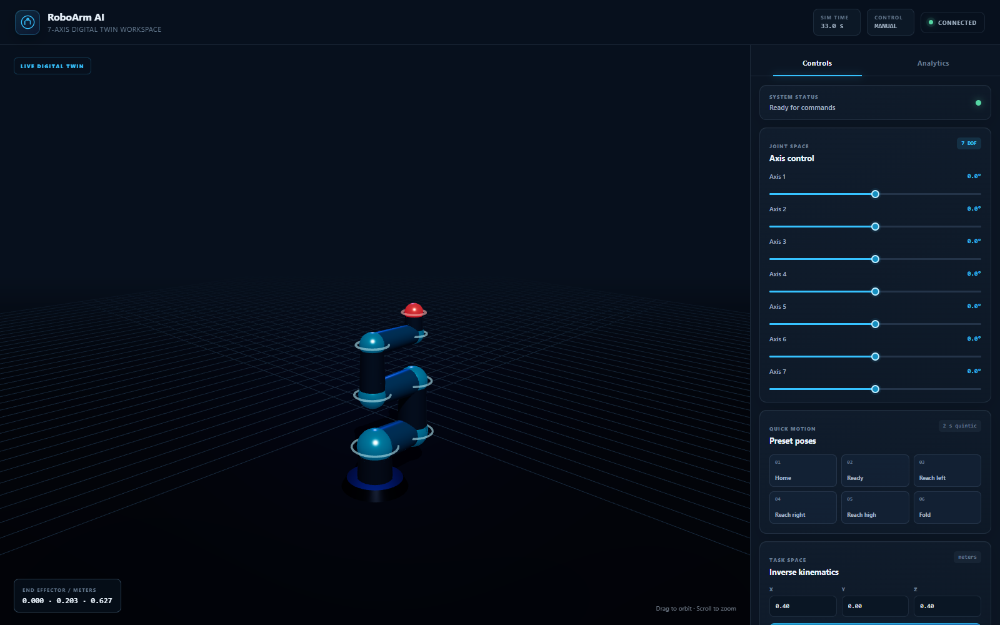

<div align="center">

# RoboArm AI

### A real-time 7-axis robotic-arm digital twin in the browser

[](https://github.com/Aman10n/RoboArm-/actions/workflows/ci.yml)
[](https://www.python.org/)
[](https://react.dev/)
[](https://fastapi.tiangolo.com/)

Interactive joint control, inverse kinematics, smooth trajectory generation, live telemetry, and a Three.js workspace—without ROS or native physics dependencies.

</div>

## Overview

RoboArm AI is a full-stack robotics simulation workspace for a KUKA LBR iiwa-inspired 7-DOF arm. A 240 Hz Python simulation drives a responsive WebGL digital twin, while FastAPI and WebSockets expose control and telemetry interfaces for experiments, teaching, and prototyping.



> [!IMPORTANT]
> This is a mathematical simulator, not a certified robot controller or safety system. Do not connect it directly to physical machinery without independent validation, limit enforcement, and hardware safety controls.

## Highlights

| Area | Capabilities |
| --- | --- |
| Digital twin | Interactive orbit camera, real-time link geometry, workspace objects, IK target marker, and safety-zone visualization |
| Motion | Direct 7-axis control, joint-limit clamping, preset poses, damped least-squares IK, multi-point paths, and linear/cubic/quintic planning |
| Safety | Latched emergency stop, enforced keep-in/keep-out zones, trajectory preflight, and live boundary alerts |
| Telemetry | 30 Hz WebSocket stream with position, velocity, torque, end-effector pose, connection latency, and persistent session samples |
| Backend | 240 Hz pure-Python PD simulation, validated REST/WebSocket commands, readiness checks, OpenAPI docs, and SQLite persistence |
| Developer experience | One-command launcher, Docker deployment, environment-based configuration, automated tests, dependency updates, and GitHub Actions CI |

## Architecture

```text
┌──────────────────────────────┐       WebSocket / REST       ┌──────────────────────────────┐
│ React + Three.js dashboard   │ ◀──────────────────────────▶ │ FastAPI application          │
│ • 3D digital twin            │                              │ • command validation         │
│ • joint and IK controls      │                              │ • telemetry broadcast        │
│ • live analytics             │                              │ • OpenAPI documentation      │
└──────────────────────────────┘                              └──────────────┬───────────────┘
                                                                             │
                                                              ┌──────────────▼───────────────┐
                                                              │ Simulation core              │
                                                              │ • DH forward kinematics      │
                                                              │ • damped least-squares IK    │
                                                              │ • PD joint dynamics at 240Hz │
                                                              │ • trajectory executor        │
                                                              └──────────────┬───────────────┘
                                                                             │
                                                              ┌──────────────▼───────────────┐
                                                              │ SQLite session store         │
                                                              └──────────────────────────────┘
```

## Quick start

### Prerequisites

- Python 3.10 or newer
- Node.js 20.19+ or 22.12+ (Node.js 24 LTS recommended)
- Git

### Install

```bash
git clone https://github.com/Aman10n/RoboArm-.git
cd RoboArm-

python -m venv .venv
```

Activate the virtual environment:

```bash
# Windows PowerShell
.venv\Scripts\Activate.ps1

# macOS / Linux
source .venv/bin/activate
```

Install and initialize the project:

```bash
python -m pip install -r requirements.txt
python setup.py

cd frontend
npm install
cd ..
```

### Run

```bash
python run.py
```

The launcher starts both services and opens the interface automatically:

- Web app: <http://localhost:5173>
- API documentation: <http://localhost:8000/docs>
- Health endpoint: <http://localhost:8000/api/health>

Use `python run.py --no-browser` for a terminal-only launch. For separate terminals:

```bash
# Terminal 1
python -m uvicorn backend.main:app --reload --host 127.0.0.1 --port 8000

# Terminal 2
cd frontend
npm run dev
```

### Run with Docker

Build and start the production image with the frontend and API served together on one port:

```bash
docker compose up --build
```

Open <http://localhost:8000>. The named `roboarm-data` volume preserves SQLite data across container restarts. Stop the service with `docker compose down`; add `--volumes` only when you intentionally want to remove that data.

## Configuration

Copy `.env.example` values into your environment as needed.

| Variable | Purpose | Default |
| --- | --- | --- |
| `ROBOARM_ALLOWED_ORIGINS` | Comma-separated browser origins accepted by the API | Local Vite origins |
| `ROBOARM_DB_PATH` | SQLite database path | `data/roboarm.db` |
| `ROBOARM_STATIC_DIR` | Optional built frontend directory served by FastAPI | Disabled |
| `ROBOARM_TELEMETRY_LOG_INTERVAL` | Persist one sample for every N telemetry frames | `8` |
| `VITE_API_URL` | Optional REST base URL for a separately deployed backend | Same origin / Vite proxy |
| `VITE_WS_URL` | Optional complete telemetry WebSocket URL | Derived from the current origin |

## API overview

The full, interactive contract is available in Swagger UI at `/docs`.

| Method | Endpoint | Description |
| --- | --- | --- |
| `GET` | `/api/status` | Simulation, session, and connection status |
| `GET` | `/api/ready` | Database and simulator readiness |
| `GET` | `/api/robot` | Robot metadata and joint limits |
| `POST` | `/api/joints/set` | Command all seven joint targets |
| `POST` | `/api/ik` | Solve and command a Cartesian target |
| `POST` | `/api/trajectory/plan` | Generate a joint-space trajectory |
| `POST` | `/api/trajectory/execute` | Execute a time-aware trajectory |
| `POST` | `/api/trajectory/multi/execute` | Execute a validated multi-point path |
| `GET` | `/api/trajectory/status` | Inspect live execution progress and outcome |
| `POST` | `/api/trajectory/stop` | Stop the active trajectory safely |
| `GET/POST` | `/api/safety-zones` | List or create workspace safety zones |
| `GET` | `/api/sessions` | List persisted simulation sessions |
| `POST` | `/api/emergency-stop` | Latch the arm at its current position |
| `WS` | `/ws/telemetry` | Stream state and accept low-latency commands |

Example trajectory request:

```bash
curl -X POST http://localhost:8000/api/trajectory/execute \
  -H "Content-Type: application/json" \
  -d '{"target_angles":[0,-0.5,0,1,0,-0.5,0],"duration":2,"method":"quintic","num_points":120}'
```

## Quality checks

```bash
# Backend
python -m pip install -r requirements-dev.txt
python -m pytest
python -m compileall -q backend run.py setup.py
python -m ruff check backend tests run.py setup.py

# Frontend
cd frontend
npm run check
```

Every push and pull request runs these checks in GitHub Actions.

## Project structure

```text
RoboArm-/
├── backend/
│   ├── main.py                 # REST and WebSocket application
│   ├── db.py                   # SQLite persistence
│   └── simulation/
│       ├── env.py              # Robot model and simulation loop
│       ├── kinematics.py       # FK/IK service layer
│       └── trajectory.py       # Planners and executor
├── frontend/
│   └── src/                    # React controls, analytics, and 3D viewer
├── tests/                      # Simulation and API tests
├── Dockerfile                  # Multi-stage production image
├── compose.yaml                # Container runtime and persistent data
├── run.py                      # Local multi-service launcher
└── setup.py                    # Database and directory initialization
```

## Roadmap

- Orientation-aware inverse kinematics
- Recorded trajectory playback and export
- Geometric collision detection for workspace objects
- Task-level policies and reinforcement-learning experiments
- Optional ROS 2 and hardware adapter layers

See [CHANGELOG.md](CHANGELOG.md) for release history. Contributions are welcome; read [CONTRIBUTING.md](CONTRIBUTING.md) for the development workflow and [SECURITY.md](SECURITY.md) for responsible vulnerability reporting.
